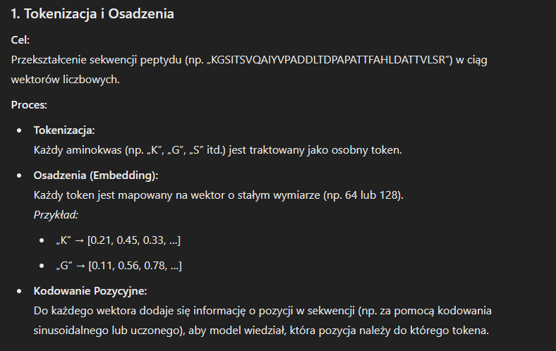
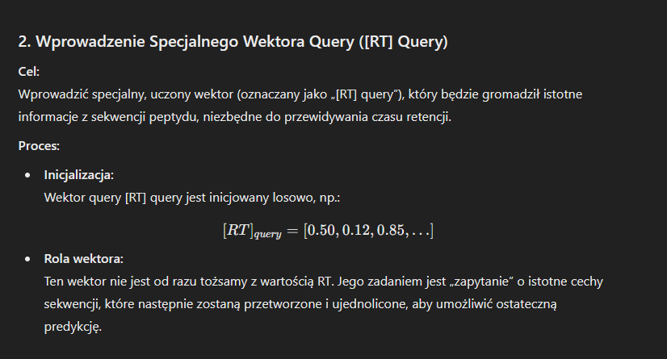
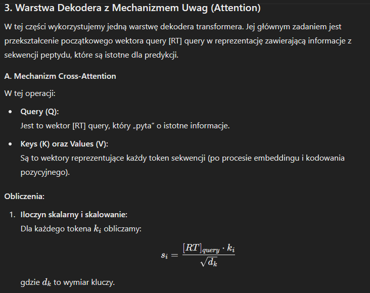
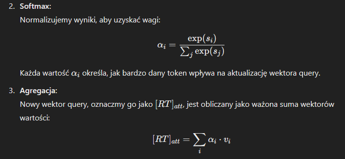
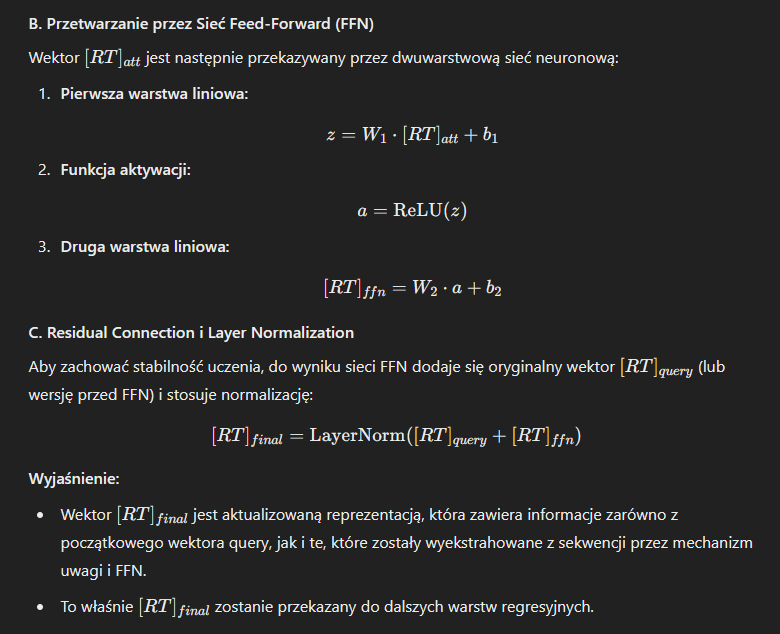
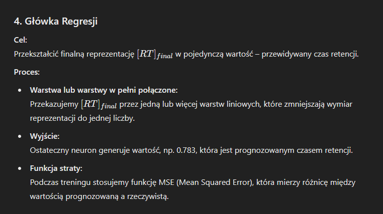
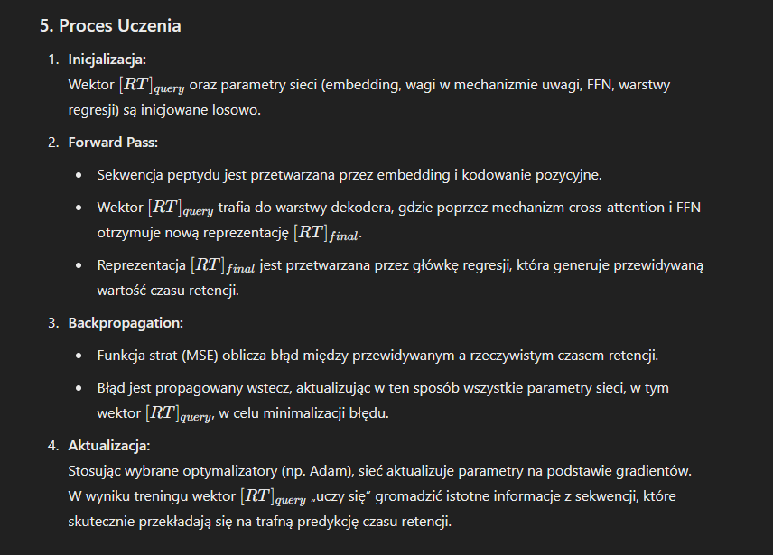

### 1. Tokenizacja i Osadzenia

**Cel:**
Przekształcenie sekwencji peptydu (np. „KGSITSVQAIYVPADDLTDPAPATTFAHLDATTVLSR”) w ciąg wektorów liczbowych.

**Proces:**

- **Tokenizacja:**
  Każdy aminokwas (np. „K”, „G”, „S” itd.) jest traktowany jako osobny token.

- **Osadzenia (Embedding):**
  Każdy token jest mapowany na wektor o stałym wymiarze (np. 64 lub 128).
  *Przykład:*
  - „K” → [0.21, 0.45, 0.33, …]
  - „G” → [0.11, 0.56, 0.78, …]

- **Kodowanie Pozycyjne:**
  Do każdego wektora dodaje się informację o pozycji w sekwencji (np. za pomocą kodowania sinusoidalnego lub uczonego), aby model wiedział, która pozycja należy do którego tokena.

---

### 2. Wprowadzenie Specjalnego Wektora Query ([RT] Query)

**Cel:**
Wprowadzić specjalny, uczony wektor (oznaczany jako „[RT] query”), który będzie gromadził istotne informacje z sekwencji peptydu, niezbędne do przewidywania czasu retencji.

**Proces:**

- **Inicjalizacja:**
  Wektor query [RT] query jest inicjowany losowo, np.:
  \[
  [RT]_{query} = [0.50, 0.12, 0.85, …]
  \]

- **Rola wektora:**
  Ten wektor nie jest od razu tożsamy z wartością RT. Jego zadaniem jest „zapytanie” o istotne cechy sekwencji, które następnie zostaną przetworzone i ujednolicone, aby umożliwić ostateczną predykcję.

---

### 3. Warstwa Dekodera z Mechanizmem Uwag (Attention)

W tej części wykorzystujemy jedną warstwę dekodera transformera. Jej głównym zadaniem jest przekształcenie początkowego wektora query [RT] query w reprezentację zawierającą informacje z sekwencji peptydu, które są istotne dla predykcji.

#### A. Mechanizm Cross-Attention

W tej operacji:

- **Query (Q):**
  Jest to wektor [RT] query, który „pyta” o istotne informacje.

- **Keys (K) oraz Values (V):**
  Są to wektory reprezentujące każdy token sekwencji (po procesie embeddingu i kodowania pozycyjnego).

**Obliczenia:**

1. **Iloczyn skalarny i skalowanie:**
   Dla każdego tokena \( k_i \) obliczamy:
   \[
   s_i = \frac{[RT]_{query} \cdot k_i}{\sqrt{d_k}}
   \]
   gdzie \( d_k \) to wymiar kluczy.

2. **Softmax:**
   Normalizujemy wyniki, aby uzyskać wagi:
   \[
   \alpha_i = \frac{\exp(s_i)}{\sum_j \exp(s_j)}
   \]
   Każda wartość \( \alpha_i \) określa, jak bardzo dany token wpływa na aktualizację wektora query.

3. **Agregacja:**
   Nowy wektor query, oznaczmy go jako \( [RT]_{att} \), jest obliczany jako ważona suma wektorów wartości:
   \[
   [RT]_{att} = \sum_i \alpha_i \cdot v_i
   \]

*Przykład:*
Jeśli sekwencja zawiera 5 tokenów i otrzymamy następujące wagi po softmax:
- Token 1: \( \alpha_1 = 0.1 \)
- Token 2: \( \alpha_2 = 0.3 \)
- Token 3: \( \alpha_3 = 0.5 \)
- Token 4: \( \alpha_4 = 0.05 \)
- Token 5: \( \alpha_5 = 0.05 \)

To nowy wektor \( [RT]_{att} \) wyniesie:
\[
[RT]_{att} = 0.1 \cdot v_1 + 0.3 \cdot v_2 + 0.5 \cdot v_3 + 0.05 \cdot v_4 + 0.05 \cdot v_5
\]

#### B. Przetwarzanie przez Sieć Feed-Forward (FFN)

Wektor \( [RT]_{att} \) jest następnie przekazywany przez dwuwarstwową sieć neuronową:
1. **Pierwsza warstwa liniowa:**
   \[
   z = W_1 \cdot [RT]_{att} + b_1
   \]
2. **Funkcja aktywacji:**
   \[
   a = \text{ReLU}(z)
   \]
3. **Druga warstwa liniowa:**
   \[
   [RT]_{ffn} = W_2 \cdot a + b_2
   \]

#### C. Residual Connection i Layer Normalization

Aby zachować stabilność uczenia, do wyniku sieci FFN dodaje się oryginalny wektor \( [RT]_{query} \) (lub wersję przed FFN) i stosuje normalizację:

\[
[RT]_{final} = \text{LayerNorm}([RT]_{query} + [RT]_{ffn})
\]

**Wyjaśnienie:**
- Wektor \( [RT]_{final} \) jest aktualizowaną reprezentacją, która zawiera informacje zarówno z początkowego wektora query, jak i te, które zostały wyekstrahowane z sekwencji przez mechanizm uwagi i FFN.
- To właśnie \( [RT]_{final} \) zostanie przekazany do dalszych warstw regresyjnych.

---

### 4. Główka Regresji

**Cel:**
Przekształcić finalną reprezentację \( [RT]_{final} \) w pojedynczą wartość – przewidywany czas retencji.

**Proces:**

- **Warstwa lub warstwy w pełni połączone:**
  Przekazujemy \( [RT]_{final} \) przez jedną lub więcej warstw liniowych, które zmniejszają wymiar reprezentacji do jednej liczby.

- **Wyjście:**
  Ostateczny neuron generuje wartość, np. 0.783, która jest prognozowanym czasem retencji.

- **Funkcja straty:**
  Podczas treningu stosujemy funkcję MSE (Mean Squared Error), która mierzy różnicę między wartością prognozowaną a rzeczywistą.

---

### 5. Proces Uczenia

1. **Inicjalizacja:**
   Wektor \( [RT]_{query} \) oraz parametry sieci (embedding, wagi w mechanizmie uwagi, FFN, warstwy regresji) są inicjowane losowo.

2. **Forward Pass:**
   - Sekwencja peptydu jest przetwarzana przez embedding i kodowanie pozycyjne.
   - Wektor \( [RT]_{query} \) trafia do warstwy dekodera, gdzie poprzez mechanizm cross-attention i FFN otrzymuje nową reprezentację \( [RT]_{final} \).
   - Reprezentacja \( [RT]_{final} \) jest przetwarzana przez główkę regresji, która generuje przewidywaną wartość czasu retencji.

3. **Backpropagation:**
   - Funkcja strat (MSE) oblicza błąd między przewidywanym a rzeczywistym czasem retencji.
   - Błąd jest propagowany wstecz, aktualizując w ten sposób wszystkie parametry sieci, w tym wektor \( [RT]_{query} \), w celu minimalizacji błędu.

4. **Aktualizacja:**
   Stosując wybrane optymalizatory (np. Adam), sieć aktualizuje parametry na podstawie gradientów.
   W wyniku treningu wektor \( [RT]_{query} \) „uczy się” gromadzić istotne informacje z sekwencji, które skutecznie przekładają się na trafną predykcję czasu retencji.

---

### Podsumowanie

1. **Wejście:**
   - Sekwencja peptydu → tokenizacja, embedding, kodowanie pozycyjne

2. **Wektor Query:**
   - Inicjalizowany losowo jako \( [RT]_{query} \)
   - Jego zadaniem jest zbieranie istotnych cech sekwencji

3. **Dekoder z Cross-Attention:**
   - Wektor \( [RT]_{query} \) oblicza uwagi względem każdego tokena sekwencji (Q, K, V)
   - Obliczony wynik (ważona suma) przechodzi przez FFN
   - Stosowane są residual connection i layer normalization, dając \( [RT]_{final} \)

4. **Główka Regresji:**
   - \( [RT]_{final} \) trafia do warstw liniowych, które generują pojedynczą wartość – przewidywany czas retencji

5. **Uczenie:**
   - Przez propagację wsteczną (backpropagation) sieć aktualizuje wszystkie parametry, w tym \( [RT]_{query} \), tak aby minimalizować błąd predykcji (MSE)


```
Peptide Sequence Input
    (np. "KGSITSVQAIYVPADDLTDPAPATTFAHLDATTVLSR")
            |
            |
            v
+-----------------------+
|   Token Embedding     |
| + Positional Encoding |
+-----------------------+
            |
            | (reprezentacja sekwencji jako wektory)
            |
            |
   Decoder block start
            |
            v                              +------------------------+
  Keys & Values -------------------------> |                        |
                                           |                        |
                                           |    Cross-Attention     |
                                           |                        |
[RT] Query (uczony wektor) --------------> | (Q = [RT] query)       |
               |                           | (K,V = z sekwencji)    |
               |                           |                        |
               |                           +------------------------+
               |                                     |
               |                                     v
               |                         +--------------------------+
               |                         | Feedforward Neural Net   |
               |                         |        (FFN)             |
               |                         +--------------------------+
               |                                     |
               |                                     v
               |              +-----------------------------------------+
               |              | Residual Connection + LayerNorm        |
               +------------> | ([RT] query + FFN output)              |
                              +-----------------------------------------+
                                                     |
                                             Decoder block end
                                                     |
                                                     |
                                                     v
                                +-----------------------------------+
                                | Regression Head (Dense Layers)   |
                                | (np. Linear -> ReLU -> Linear)   |
                                +-----------------------------------+
                                                     |
                                                     v
                              Predicted Retention Time (np. 0.783)
```
















!!!!!
https://analyticalsciencejournals.onlinelibrary.wiley.com/doi/10.1002/pmic.202200041